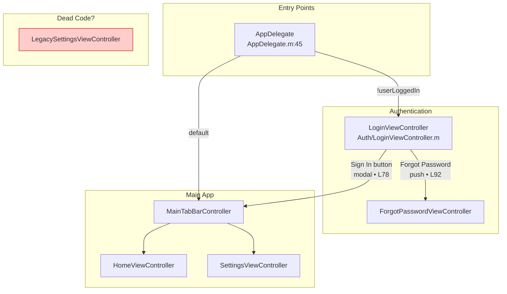

# Objective-C Project Navigation Flow Analyzer

## Purpose

You are analyzing an Objective-C iOS project to produce navigation documentation that serves two audiences:
1. **Human developers** — for onboarding and understanding the codebase
2. **AI agents** — as a reference for locating code when making changes

The output must map all app entry points and trace user interactions to the screens they open.

This prompt supports both **initial analysis** and **incremental updates** to keep documentation current.

---

## Phase 1: Identify App Entry Points

Locate and document all application lifecycle entry points. Search for:

### AppDelegate Methods
```objc
// Primary entry point
- (BOOL)application:(UIApplication *)application didFinishLaunchingWithOptions:(NSDictionary *)launchOptions

// State restoration
- (BOOL)application:(UIApplication *)application shouldRestoreApplicationState:(NSCoder *)coder
- (UIViewController *)application:(UIApplication *)application viewControllerWithRestorationIdentifierPath:(NSArray *)path

// Background/foreground transitions that may trigger UI
- (void)applicationDidBecomeActive:(UIApplication *)application
- (void)applicationWillEnterForeground:(UIApplication *)application
```

### SceneDelegate Methods (iOS 13+, if present)
```objc
- (void)scene:(UIScene *)scene willConnectToSession:(UISceneSession *)session options:(UISceneConnectionOptions *)connectionOptions
- (void)sceneDidBecomeActive:(UIScene *)scene
```

### For Each Entry Point, Document:
- File path and line number
- Initial view controller(s) set or presented
- Any conditional logic determining initial screen (e.g., login state, onboarding completion)

---

## Phase 2: Catalog All Screens

Scan the project to identify all screen components. A "screen" is any of:

### UIViewController Subclasses
```objc
@interface *ViewController : UIViewController
@interface *VC : UIViewController
@interface * : UITableViewController
@interface * : UICollectionViewController
@interface * : UINavigationController
@interface * : UITabBarController
```

### UIView Subclasses Acting as Full-Screen Content
Look for UIView subclasses that:
- Are added as the root view of a container
- Have names suggesting screen-level purpose (e.g., `*ScreenView`, `*ContentView`)
- Are instantiated and presented as primary content

### XIB Files
- List all `.xib` files
- Identify the File's Owner class
- Note if the XIB represents a full screen vs. a reusable component

### For Each Screen, Document:
| Field | Description |
|-------|-------------|
| **Name** | Class name |
| **Type** | ViewController / View / XIB |
| **File** | Path to .h and .m files |
| **XIB** | Associated XIB file, if any |
| **Purpose** | Brief description inferred from class name, comments, or visible content |

---

## Phase 3: Parse XIB Files — Full Outlet and Action Mapping

For each XIB file, parse the XML to extract complete interface structure.

### XIB Structure to Extract

#### File's Owner
```xml
<placeholder placeholderIdentifier="IBFilesOwner" id="..." userLabel="File's Owner" customClass="SomeViewController">
```
Document: Custom class name, placeholder ID

#### Outlet Connections
```xml
<outlet property="propertyName" destination="elementId" id="connectionId"/>
```

For each outlet, document:
| Field | Description |
|-------|-------------|
| **Property Name** | The IBOutlet property name in code |
| **Element Type** | UIButton, UILabel, UITableView, etc. |
| **Element ID** | XIB internal ID for cross-referencing |
| **Code Location** | Corresponding @property declaration in .h or .m |

#### Action Connections
```xml
<action selector="methodName:" destination="targetId" eventType="touchUpInside" id="connectionId"/>
```

For each action, document:
| Field | Description |
|-------|-------------|
| **Selector** | The IBAction method name |
| **Event Type** | touchUpInside, valueChanged, etc. |
| **Source Element** | The UI element triggering the action (with type and any identifier/label) |
| **Target** | File's Owner or other object |

#### UI Element Inventory
For each significant UI element in the XIB:
```xml
<button id="..." >
    <rect key="frame" x="..." y="..." width="..." height="..."/>
    <state key="normal" title="Button Title"/>
    <connections>
        <action selector="buttonTapped:" .../>
    </connections>
</button>
```

Document:
| Field | Description |
|-------|-------------|
| **Element Type** | UIButton, UITextField, UITableView, etc. |
| **XIB ID** | Internal identifier |
| **Label/Title** | User-visible text if any |
| **Accessibility ID** | If set, for test automation reference |
| **Connected Outlets** | Which properties this element is wired to |
| **Connected Actions** | Which methods this element triggers |

### XIB Output Format

For each XIB, produce:

```markdown
### LoginViewController.xib

**File's Owner:** `LoginViewController`

#### Outlets
| Property | Element Type | Label/Title | XIB ID |
|----------|--------------|-------------|--------|
| usernameField | UITextField | — | abc-123 |
| passwordField | UITextField | — | def-456 |
| signInButton | UIButton | "Sign In" | ghi-789 |
| forgotPasswordButton | UIButton | "Forgot Password?" | jkl-012 |

#### Actions
| Method | Event | Element | Label/Title |
|--------|-------|---------|-------------|
| signInButtonTapped: | touchUpInside | UIButton | "Sign In" |
| forgotPasswordTapped: | touchUpInside | UIButton | "Forgot Password?" |
| textFieldDidChange: | editingChanged | UITextField | — |

#### Element Hierarchy (significant elements only)
- UIView (root)
  - UIImageView (logo)
  - UITextField → `usernameField`
  - UITextField → `passwordField`
  - UIButton "Sign In" → `signInButton` → `signInButtonTapped:`
  - UIButton "Forgot Password?" → `forgotPasswordButton` → `forgotPasswordTapped:`
```

---

## Phase 4: Trace Navigation Flows

For each screen identified in Phase 2, find all code paths that navigate TO that screen.

### Navigation Patterns to Search

#### Programmatic Presentation
```objc
// Push navigation
[self.navigationController pushViewController:* animated:*]
[navigationController pushViewController:* animated:*]

// Modal presentation
[self presentViewController:* animated:* completion:*]
[* presentViewController:* animated:* completion:*]

// Show (adaptive)
[self showViewController:* sender:*]
[self showDetailViewController:* sender:*]
```

#### View Controller Instantiation
```objc
// Programmatic
[[*ViewController alloc] init]
[[*ViewController alloc] initWithNibName:* bundle:*]

// Storyboard (if any storyboards exist)
[storyboard instantiateViewControllerWithIdentifier:*]
[self performSegueWithIdentifier:* sender:*]
```

#### Container View Controller Patterns
```objc
[self addChildViewController:*]
[* addChildViewController:*]
[self.containerView addSubview:childVC.view]
```

#### Popover and Alert Presentation
```objc
// Popovers
controller.modalPresentationStyle = UIModalPresentationPopover
[popover presentPopoverFromRect:* inView:* permittedArrowDirections:* animated:*]
[popover presentPopoverFromBarButtonItem:* permittedArrowDirections:* animated:*]

// Alerts/Action Sheets
[UIAlertController alertControllerWithTitle:* message:* preferredStyle:*]
[self presentViewController:alertController animated:* completion:*]
```

#### XIB Loading
```objc
[[NSBundle mainBundle] loadNibNamed:* owner:* options:*]
[UINib nibWithNibName:* bundle:*]
```

### For Each Navigation Path, Document:

| Field | Description |
|-------|-------------|
| **Source Screen** | The screen where the interaction originates |
| **Trigger** | What initiates navigation (button tap, cell selection, gesture, programmatic) |
| **Trigger Location** | File path and line number of the triggering code |
| **Transition Type** | `push` / `modal` / `popover` / `embed` / `replace` / `alert` |
| **Target Screen** | The destination screen class |
| **Target Instantiation** | How the target is created (alloc/init, XIB, storyboard) |
| **Conditions** | Any conditional logic guarding this navigation (if/else, feature flags) |

---

## Phase 5: Identify Triggering Elements

For each navigation, trace back to the user interaction that triggers it.

### IBAction Methods
```objc
- (IBAction)*:(id)sender
- (IBAction)*:(UIButton *)sender
```

### Gesture Recognizers
```objc
[[UITapGestureRecognizer alloc] initWithTarget:* action:*]
[* addGestureRecognizer:*]
```

### Table/Collection View Selection
```objc
- (void)tableView:(UITableView *)tableView didSelectRowAtIndexPath:(NSIndexPath *)indexPath
- (void)collectionView:(UICollectionView *)collectionView didSelectItemAtIndexPath:(NSIndexPath *)indexPath
```

### Target-Action Patterns
```objc
[button addTarget:* action:* forControlEvents:*]
[* addTarget:self action:@selector(*) forControlEvents:*]
```

### For Triggers Defined in XIB Files
Cross-reference Phase 3 XIB parsing output to associate:
- UI element type and label/title with the IBAction method
- Outlet property name for identification in code

---

## Phase 6: Produce Output Documentation

Generate three interconnected outputs:

### Output 1: Navigation Map (Markdown)

```markdown
# App Navigation Map

**Generated:** 2024-01-15T10:30:00Z
**Commit:** a1b2c3d (include if git available)

## Entry Points

### AppDelegate
- **File:** `AppDelegate.m:45`
- **Initial Screen:** `MainTabBarController`
- **Conditions:** 
  - If not logged in → `LoginViewController`
  - If first launch → `OnboardingViewController`

## Screen Inventory

| Screen | Type | File | XIB | Purpose |
|--------|------|------|-----|---------|
| MainTabBarController | ViewController | Classes/Main/MainTabBarController.m | — | Root tab container |
| LoginViewController | ViewController | Classes/Auth/LoginViewController.m | LoginViewController.xib | User authentication |
| ... | ... | ... | ... | ... |

## XIB Mappings

### LoginViewController.xib
(Full outlet/action table from Phase 3)

## Navigation Flows

### From: LoginViewController

| Trigger | Element | Transition | Target | Location |
|---------|---------|------------|--------|----------|
| Button tap | "Sign In" button (`signInButton` → `signInButtonTapped:`) | modal | MainTabBarController | LoginViewController.m:78 |
| Button tap | "Forgot Password" link (`forgotPasswordButton` → `forgotPasswordTapped:`) | push | ForgotPasswordViewController | LoginViewController.m:92 |

### From: MainTabBarController
...

## Unreachable Screens (Potential Dead Code)

The following screens have no identified navigation path leading to them:

| Screen | File | Notes |
|--------|------|-------|
| LegacySettingsViewController | Classes/Legacy/LegacySettingsViewController.m | May be deprecated |
| TestViewController | Classes/Debug/TestViewController.m | Possibly debug-only |

**Action Required:** Verify if these screens are intentionally unreachable or should be removed.
```

### Output 2: Quick Reference Index (JSON)

```json
{
  "metadata": {
    "generated": "2024-01-15T10:30:00Z",
    "commit": "a1b2c3d",
    "version": "1.0.0"
  },
  "screens": {
    "LoginViewController": {
      "files": {
        "header": "Classes/Auth/LoginViewController.h",
        "implementation": "Classes/Auth/LoginViewController.m",
        "xib": "Classes/Auth/LoginViewController.xib"
      },
      "xibMapping": {
        "outlets": [
          {"property": "usernameField", "type": "UITextField", "xibId": "abc-123"},
          {"property": "passwordField", "type": "UITextField", "xibId": "def-456"},
          {"property": "signInButton", "type": "UIButton", "label": "Sign In", "xibId": "ghi-789"}
        ],
        "actions": [
          {"selector": "signInButtonTapped:", "event": "touchUpInside", "element": "UIButton", "label": "Sign In"},
          {"selector": "forgotPasswordTapped:", "event": "touchUpInside", "element": "UIButton", "label": "Forgot Password?"}
        ]
      },
      "navigatesTo": [
        {
          "target": "MainTabBarController",
          "trigger": {
            "type": "IBAction",
            "method": "signInButtonTapped:",
            "outlet": "signInButton",
            "elementType": "UIButton",
            "label": "Sign In"
          },
          "transition": "modal",
          "file": "LoginViewController.m",
          "line": 78
        }
      ],
      "reachedFrom": [
        {
          "source": "AppDelegate",
          "condition": "!userLoggedIn",
          "file": "AppDelegate.m",
          "line": 52
        }
      ]
    }
  },
  "entryPoints": {
    "AppDelegate": {
      "file": "AppDelegate.m",
      "method": "application:didFinishLaunchingWithOptions:",
      "line": 45,
      "initialScreens": [
        {"screen": "MainTabBarController", "condition": "default"},
        {"screen": "LoginViewController", "condition": "!userLoggedIn"},
        {"screen": "OnboardingViewController", "condition": "firstLaunch"}
      ]
    }
  },
  "unreachableScreens": [
    {
      "screen": "LegacySettingsViewController",
      "file": "Classes/Legacy/LegacySettingsViewController.m",
      "reason": "No navigation path found"
    }
  ]
}
```

### Output 3: Visual Diagram (Mermaid)



---

## Phase 7: Incremental Update Mode

When re-running analysis on a previously documented project, produce a **change report** in addition to updated documentation.

### Pre-Requisites for Update Mode
- Previous output files must be available (JSON is primary for diffing)
- Access to git or file modification timestamps preferred

### Diff Process

1. **Load previous JSON output** as baseline
2. **Run full analysis** (Phases 1-5) to generate current state
3. **Compare and categorize changes:**

#### Change Categories

| Category | Description |
|----------|-------------|
| **ADDED** | New screens, navigation paths, outlets, or entry points |
| **REMOVED** | Screens, navigation paths, or outlets no longer present |
| **MODIFIED** | Changes to existing items (line numbers, conditions, transitions) |
| **MOVED** | Same item relocated to different file/line |

### Change Report Format (Markdown)

```markdown
# Navigation Map — Change Report

**Previous Analysis:** 2024-01-10T10:30:00Z (commit: xyz789)
**Current Analysis:** 2024-01-15T10:30:00Z (commit: a1b2c3d)

## Summary
- **Screens:** 2 added, 1 removed, 0 modified
- **Navigation Paths:** 3 added, 0 removed, 2 modified
- **XIB Changes:** 1 file modified (5 outlets changed)
- **Unreachable Screens:** 1 new, 0 resolved

---

## Added Screens

### ProfileViewController (NEW)
- **File:** `Classes/Profile/ProfileViewController.m`
- **XIB:** `ProfileViewController.xib`
- **Reached from:** SettingsViewController via "View Profile" button (push)

---

## Removed Screens

### OldProfileViewController (DELETED)
- **Previous location:** `Classes/Profile/OldProfileViewController.m`
- **Was reached from:** SettingsViewController
- **Action:** Verify intentional removal; update any remaining references

---

## Modified Navigation Paths

### SettingsViewController → ProfileViewController
| Field | Previous | Current |
|-------|----------|---------|
| Target | OldProfileViewController | ProfileViewController |
| Line | 145 | 152 |
| Transition | modal | push |

---

## XIB Changes

### SettingsViewController.xib

#### Added Outlets
| Property | Type | Label |
|----------|------|-------|
| profileButton | UIButton | "View Profile" |

#### Removed Outlets
| Property | Type | Notes |
|----------|------|-------|
| oldProfileButton | UIButton | Replaced by profileButton |

#### Modified Actions
| Selector | Change |
|----------|--------|
| showProfile: | Renamed from showOldProfile: |

---

## Newly Unreachable Screens

### BetaFeatureViewController
- **File:** `Classes/Beta/BetaFeatureViewController.m`
- **Previously reached from:** SettingsViewController (feature flag: `betaEnabled`)
- **Possible cause:** Feature flag check removed in SettingsViewController.m:89
- **Action:** Verify if feature was intentionally disabled or if this is a bug

---

## Previously Unreachable — Now Reachable

(None this cycle)
```

### Change Report Format (JSON)

```json
{
  "changeReport": {
    "previousAnalysis": {
      "timestamp": "2024-01-10T10:30:00Z",
      "commit": "xyz789"
    },
    "currentAnalysis": {
      "timestamp": "2024-01-15T10:30:00Z",
      "commit": "a1b2c3d"
    },
    "summary": {
      "screens": {"added": 2, "removed": 1, "modified": 0},
      "navigationPaths": {"added": 3, "removed": 0, "modified": 2},
      "xibChanges": {"filesModified": 1, "outletsChanged": 5},
      "unreachable": {"new": 1, "resolved": 0}
    },
    "changes": {
      "addedScreens": [
        {
          "screen": "ProfileViewController",
          "file": "Classes/Profile/ProfileViewController.m",
          "xib": "ProfileViewController.xib"
        }
      ],
      "removedScreens": [
        {
          "screen": "OldProfileViewController",
          "previousFile": "Classes/Profile/OldProfileViewController.m"
        }
      ],
      "modifiedNavigationPaths": [
        {
          "source": "SettingsViewController",
          "previous": {
            "target": "OldProfileViewController",
            "line": 145,
            "transition": "modal"
          },
          "current": {
            "target": "ProfileViewController",
            "line": 152,
            "transition": "push"
          }
        }
      ],
      "xibChanges": {
        "SettingsViewController.xib": {
          "addedOutlets": [
            {"property": "profileButton", "type": "UIButton", "label": "View Profile"}
          ],
          "removedOutlets": [
            {"property": "oldProfileButton", "type": "UIButton"}
          ],
          "modifiedActions": [
            {"selector": "showProfile:", "previousSelector": "showOldProfile:"}
          ]
        }
      },
      "newlyUnreachable": [
        {
          "screen": "BetaFeatureViewController",
          "file": "Classes/Beta/BetaFeatureViewController.m",
          "previouslyReachedFrom": "SettingsViewController",
          "possibleCause": "Feature flag check removed"
        }
      ]
    }
  }
}
```

---

## Execution Guidelines

### Search Strategy
1. Start with `AppDelegate.m` / `SceneDelegate.m` to find entry points
2. Use recursive grep/ripgrep for pattern matching across the codebase
3. Parse XIB files as XML to extract complete outlet and action mappings
4. Follow instantiation chains to their presentation calls
5. Cross-reference XIB element IDs with outlet/action connections

### XIB Parsing Commands
```bash
# Find all XIB files
find . -name "*.xib" -type f

# Extract File's Owner class
grep -o 'customClass="[^"]*"' *.xib

# Extract outlets (pipe XIB through xmllint or similar for structured parsing)
xmllint --xpath "//outlet" SomeView.xib

# Extract actions
xmllint --xpath "//action" SomeView.xib
```

### Handle Ambiguity
- If a view controller is instantiated but the presentation method is unclear, note it as "instantiation found, presentation unclear" with the file location
- If navigation is conditional, document all branches
- If using a custom navigation pattern (e.g., coordinator-like), document the pattern and its entry points
- If XIB structure is unusual, document the deviation

### Update Mode Detection
Automatically enter update mode if:
- Previous JSON output file exists at expected location
- User explicitly requests "update" or "refresh"

If previous output exists but cannot be parsed, warn and proceed with fresh analysis.

### Quality Checks Before Completion

#### Initial Analysis
- [ ] Every UIViewController subclass is cataloged
- [ ] Every XIB file has complete outlet and action mapping
- [ ] Every cataloged screen has at least one "reached from" path (except flagged unreachable)
- [ ] Entry points document the initial screen determination logic
- [ ] File paths are relative to project root
- [ ] Line numbers point to the specific navigation call, not just the method signature
- [ ] XIB element labels/titles are captured where available

#### Update Analysis (additional checks)
- [ ] All changes categorized (added/removed/modified/moved)
- [ ] Newly unreachable screens flagged with possible cause
- [ ] Previously unreachable screens checked for new paths
- [ ] XIB changes itemized at outlet/action level
- [ ] Change report summary counts are accurate

---

## File Output Locations

Save outputs with consistent naming for update tracking:

```
docs/claude/navigation/
├── navigation-map.md          # Human-readable documentation
├── navigation-index.json      # Machine-readable index (primary for diffing)
├── navigation-diagram.mermaid # Visual diagram source
└── change-reports/
    └── changes-2024-01-15.md  # Change report (update mode only)
```

Include timestamp and git commit (if available) in all output metadata.