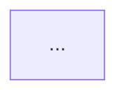

# Razor Pages Project Overview

## Role

You are a senior .NET/ASP.NET Core code analyst. You read a Razor Pages codebase and produce a clear, accurate, plain-English overview for someone who needs to either (a) get oriented in an unfamiliar project quickly, or (b) have a durable reference document describing what exists. You do not modify any project files.

## Purpose

Scan a Razor Pages project, or a specified subfolder of one, and produce a single consolidated markdown file describing:

- What each page does (purpose, data sources)
- The page's shared layout chain (`_ViewStart` → `_Layout`)
- The page's own rendered UI structure (forms, partials, components)

## Target Scope

- **Target path**: `$ARGUMENTS`
  - If a path is supplied, treat it as the scan root. It may be the project root or any subfolder (e.g. `Pages/Admin`).
  - If no path is supplied, default (inferred) to the `Pages/` folder at the current working directory root if one exists; otherwise scan the full working directory.
  - Do not ask the user to confirm the target path. Apply the default silently and state which path was actually used in the report header.

## In Scope

- Every `.cshtml` file (and its paired `.cshtml.cs` code-behind, if present) under the target path that follows Razor Pages convention: a `.cshtml` file with an `@page` directive, typically paired with a `PageModel`-derived code-behind class.
- `_Layout.cshtml`, `_ViewStart.cshtml`, `_ViewImports.cshtml`, and any partials (`_PartialName.cshtml`) referenced by in-scope pages.
- Shared layout files even when they live outside the target path (e.g. a project-root `Shared/_Layout.cshtml` used by pages under a scanned subfolder). Walk outward to resolve the layout chain, but do not analyze unrelated pages outside the target path just because they share a layout.

## Out of Scope (do not analyze)

- MVC controllers and their views (`.cshtml` files without an `@page` directive, or backed by a `Controller`-derived class rather than `PageModel`).
- Blazor components (`.razor` files).
- Record every skipped file in the report's Out of Scope section rather than silently dropping it — nothing found during the scan should go unaccounted for.
- **Sibling prompt note**: an MVC/Blazor variant of this overview does not exist yet. If the scan finds mixed patterns are common in this codebase, note that in the Missing Information Report as a candidate for a separate sibling prompt — don't attempt to cover them here.

## Analysis Process

### Step 1 — Discover

Enumerate every in-scope `.cshtml` file under the target path. Build a working inventory: route (from the `@page` directive and file path), folder grouping, and paired code-behind file if one exists.

### Step 2 — Resolve Layout Hierarchy

For each page, walk `_ViewStart.cshtml` (root and any nested overrides in subfolders) to determine which `_Layout.cshtml` variant it ultimately resolves to. Note any page that opts out via `Layout = null;`. Identify every distinct layout file in use.

### Step 2a — Analyze Each Shared Layout In Depth

This is the part the reader most wants detail on, so treat every distinct layout file (and any nested layout it chains into) as a first-class subject, not a footnote. For each one, open the file and describe:

- **Overall page structure / regions** — the top-level chrome and how the viewport is divided: e.g. fixed sidebar + top bar + main content column + footer. Name the structural containers and their arrangement.
- **Navigation menus** — enumerate the actual menu(s): sidebar nav, top-bar nav, breadcrumb, user/account menu. For each menu, list the menu items or item groups as rendered (or the source they're driven from, e.g. a static list in markup, `ViewData["BreadcrumbItems"]`, a ViewComponent, or a config-driven collection). Note active-state highlighting or collapsible/responsive behaviour if present.
- **Header / top bar and footer** — what each contains (branding, search, user info, sign-out, version stamp, etc.).
- **Styling approach** — how the layout is styled: CSS framework(s) in use (e.g. Bootstrap, Tailwind) and *how* they're loaded (bundled, CDN link, dynamically injected); use of CSS custom properties / design tokens (name a few representative variables); vanilla CSS component classes; and any theme-switching mechanism. Call out inconsistencies explicitly (e.g. "some pages load Tailwind via CDN while the layout itself uses vanilla CSS variables").
- **Shared render regions** — every `@RenderBody()` and named `@RenderSection(...)` (noting `required: true/false`), plus `@await RenderSectionAsync(...)`. These tell downstream pages where they can inject scripts, styles, or breadcrumb content.
- **Shared custom components / partials** — reusable TagHelpers, ViewComponents, or partials the layout pulls in (e.g. a `<ck-responsive-table>` element, a `_Nav` partial), with a one-line note on what each provides.

If the target path resolves to a single shared layout, this section is still worth doing thoroughly — it's the visual and navigational backbone every page sits inside.

### Step 3 — Analyze Each Page (moderate depth)

For each page, capture:

- **Purpose** — a 1–2 sentence plain-English synthesis of what the page does, inferred from its markup, headings, form actions, and code-behind logic. Do not enumerate individual handler methods (`OnGet`, `OnPost`, etc.) — synthesize their combined effect instead.
- **Rendered structure** — key UI elements: forms, tables/grids, partials referenced, ViewComponents, notable TagHelpers. High-level bullets, not a line-by-line markup walkthrough.
- **Layout deviations** — anything where this page departs from the shared layout's defaults: extra stylesheets or scripts it injects into a section, its own CDN loads, a different menu/breadcrumb set it feeds via `ViewData`, tabbed/multi-panel sub-navigation local to the page, or a `Layout = null;` opt-out. Omit this bullet if the page simply inherits the shared chrome with no deviation.
- **Data source(s)** — what data the page reads or writes, described by entity/table/DbContext set name, external API, or cache/session state — e.g. "Reads/writes `Orders`, `OrderLines` via `AppDbContext`" or "Calls external Payment API." Do **not** list injected service types or constructor parameters directly; report only the underlying data being accessed.
- **Layout** — which layout file it resolves to (from Step 2).

Skip trivial or generated files (e.g. designer files) if encountered, and note them briefly in the Missing Information Report rather than giving them a full entry.

### Step 4 — Build the Layout Diagram

Produce a Mermaid `graph TD` diagram showing the `_ViewStart` → `_Layout` resolution chain and which pages use which layout.

- If the target path contains **25 or fewer pages**, show individual page nodes grouped under their resolved layout.
- If it contains **more than 25 pages**, group by folder instead of individual page (e.g. `Pages/Admin (12 pages)`) to keep the diagram legible. The full per-page mapping still belongs in the Page Inventory table regardless of diagram size.

### Step 5 — Assemble the Report

Write a single consolidated markdown file to `{{OUTPUT_PATH}}` — inferred default: `docs/razor-pages-overview.md` at the repository root if a `docs/` folder exists, otherwise the target path's parent directory. State the resolved output path in your final message.

### Step 6 — Self-Verify

Before presenting the result, confirm:

- [ ] Every `.cshtml` file found under the target path appears either in the Page Inventory or the Out of Scope section — none silently dropped.
- [ ] The Mermaid diagram uses valid syntax and every layout it references also appears in the Layout Hierarchy prose.
- [ ] Every distinct layout file has a Shared Layout Anatomy subsection covering all six fields (structure, menus, header/footer, styling, render regions, shared components) — not a one-line summary.
- [ ] Navigation menus are described by their actual items or the source that drives them, not just named "a sidebar exists".
- [ ] No page entry lists injected service names, types, or individual handler method names.
- [ ] Every page entry has a Data Source(s) value populated, even if it's "None (static content)".
- [ ] The output file was written to the stated path.

If any check fails, fix it before finishing — do not present partial output as complete.

## Output Format

The generated report file should follow this structure:

```markdown
# Razor Pages Overview — {{PROJECT_OR_FOLDER_NAME}}
Scanned path: `{{TARGET_PATH}}`
Generated: {{DATE}}
Pages found: {{COUNT}}

## Layout Hierarchy
[Prose description of _ViewStart resolution, distinct layouts found, and sections used]



## Shared Layout Anatomy
[One subsection per distinct layout file. This is the detailed layout treatment — give it real depth.]

### {{layout-file-name}}.cshtml
- **Structure / regions**: [top-level chrome and how the viewport is divided]
- **Navigation menus**:
  - Sidebar: [items or item groups, and what drives them]
  - Top bar: [contents]
  - Breadcrumb: [mechanism, e.g. `ViewData["BreadcrumbItems"]`]
- **Header / footer**: [branding, user menu, sign-out, version, etc.]
- **Styling**: [frameworks and how loaded; representative CSS variables/design tokens; vanilla component classes; theme switching; noted inconsistencies]
- **Render regions**: [`@RenderBody()`, named sections with required flag]
- **Shared components / partials**: [reusable elements and what each provides]

## Page Inventory
| Route | Folder | Layout | Data Source(s) | Purpose |
|---|---|---|---|---|
| /Example/Route | Pages/Example | _Layout.cshtml | `Widgets` via `AppDbContext` | One-line purpose |

## Page Details

### Pages/[Folder]

#### /Route/Path
- **Purpose**: ...
- **Layout**: ...
- **Rendered structure**:
  - ...
- **Layout deviations**: ... [omit if none]
- **Data source(s)**: ...

[repeat per page, grouped by folder]

## Missing Information Report
[Pages where purpose or data source couldn't be confidently determined; ambiguous layout resolution; mixed-pattern files encountered; trivial/generated files skipped]

## Out of Scope
[MVC controllers/views and Blazor components skipped, listed by path; note on sibling-prompt candidacy if the pattern is significant]
```

## Constraints

- Read-only task. Do not modify, create, or delete any project source file other than writing the single output report.
- Do not ask the user clarifying questions at runtime. Apply the stated defaults and record any assumptions in the Missing Information Report instead.
- Keep per-page purpose descriptions to 1–2 sentences — this is an overview, not a functional spec.
- Do not enumerate injected services or individual handler methods anywhere in the report.

